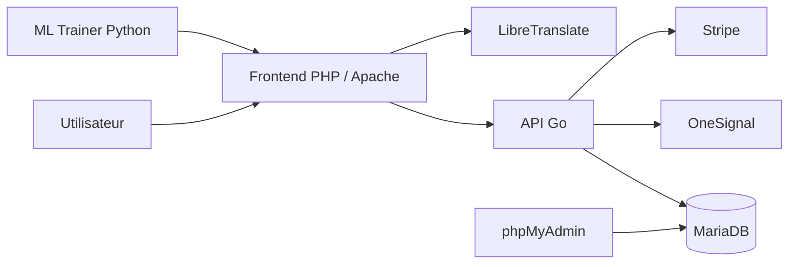

# Projet Annuel

Application conteneurisée composée d'un frontend PHP, d'une API Go, d'une base MariaDB et d'un service ML Python. Le projet est prévu pour fonctionner en développement local avec Docker Compose et en production via des images publiées sur un registre.

## Architecture



## Services

- `php` : interface web rendue par Apache + PHP 8.2.
- `go` : API métier, accès base de données, Stripe, notifications push.
- `mariadb` : stockage relationnel principal de l'application.
- `ml_trainer` : entraînement du modèle de recommandation et génération des artefacts dans `php/ml/`.
- `libretranslate` : service de traduction utilisé par l'application.
- `phpmyadmin` : outil d'administration de la base, réservé au développement.

## Choix techniques

- Docker isole chaque composant dans une image dédiée, ce qui simplifie les dépendances et le déploiement.
- Docker Compose permet d'orchestrer l'ensemble des services avec leur réseau, leurs volumes et leurs variables d'environnement.
- Une séparation `dev` / `prod` évite d'exposer en production des outils utiles uniquement au développement comme phpMyAdmin.
- Les builds multi-étapes réduisent la taille des images de production, surtout pour l'API Go.

## Variables d'environnement

Copier `.env.example` vers `.env` puis compléter les valeurs sensibles.

```powershell
Copy-Item .env.example .env
```

Le fichier `.env` n'est pas versionné. Les principales variables attendues sont :

- `MYSQL_ROOT_PASSWORD`, `MYSQL_DATABASE`, `MYSQL_USER`, `MYSQL_PASSWORD`
- `PUBLIC_API_URL`, `APP_BASE_URL`
- `STRIPE_SECRET_KEY`, `STRIPE_WEBHOOK_SECRET`, `STRIPE_PRICE_ID_MOIS`, `STRIPE_PRICE_ID_AN`
- `ONESIGNAL_APP_ID`, `ONESIGNAL_REST_API_KEY`
- `GHCR_NAMESPACE`, `APP_VERSION`

## Lancement en développement

Le fichier `docker-compose.dev.yml` active les volumes de code pour faciliter les modifications en direct.

```powershell
docker compose -f docker-compose.dev.yml up -d --build
```

Accès locaux :

- `http://localhost` : site PHP
- `http://localhost:9000` : API Go
- `http://localhost:8081` : phpMyAdmin
- `http://localhost:5000` : LibreTranslate

Pour arrêter l'environnement :

```powershell
docker compose -f docker-compose.dev.yml down
```

## Lancement en production

Le fichier `docker-compose.prod.yml` utilise des images versionnées publiées sur un registre.

```powershell
docker compose -f docker-compose.prod.yml up -d
```

Points importants :

- phpMyAdmin n'est pas inclus.
- Les données MariaDB sont persistées dans un volume dédié.
- Les uploads et les artefacts ML sont persistés dans des volumes dédiés.
- Les services redémarrent automatiquement sauf `ml_trainer`.

## Registre d'images

Le choix recommandé ici est `GHCR` car il s'intègre bien avec GitHub, gère les versions d'images et reste simple à présenter en soutenance.

Exemple de build et de publication :

```powershell
docker build -t ghcr.io/mon-compte/projetannuel-go:1.0.0 -f go/dockerfile --target production go
docker build -t ghcr.io/mon-compte/projetannuel-php:1.0.0 -f php/dockerfile --target production php
docker build -t ghcr.io/mon-compte/projetannuel-ml:1.0.0 -f ml/Dockerfile --target production ml

docker push ghcr.io/mon-compte/projetannuel-go:1.0.0
docker push ghcr.io/mon-compte/projetannuel-php:1.0.0
docker push ghcr.io/mon-compte/projetannuel-ml:1.0.0
```

Ensuite, définir dans `.env` :

```env
GHCR_NAMESPACE=ghcr.io/mon-compte
APP_VERSION=1.0.0
```

## Logs et debug

Afficher les logs de tous les services :

```powershell
docker compose -f docker-compose.dev.yml logs -f
```

Afficher les logs d'un service précis :

```powershell
docker compose -f docker-compose.dev.yml logs -f go
docker compose -f docker-compose.dev.yml logs -f php
docker compose -f docker-compose.dev.yml logs -f mariadb
```

## Module ML

Le service `ml_trainer` génère dans `php/ml/` :

- `modele_silver_happy.pkl`
- `colonnes_features.pkl`
- `training_report.json`
- `training_report.txt`

Consulter les résultats dans :

- `http://localhost/index_module_ml.php`

Relancer un entraînement :

```powershell
docker compose -f docker-compose.dev.yml run --rm ml_trainer
```

## Livrables à rendre

- code source
- Dockerfiles
- `docker-compose.dev.yml`
- `docker-compose.prod.yml`
- `.env.example`
- documentation de déploiement
- diagramme d'architecture

## Notes utiles

- Si le navigateur conserve un ancien JavaScript : `Ctrl + F5`.
- Si vous voulez repartir d'une base vide, supprimer le volume MariaDB concerné puis relancer Compose.


